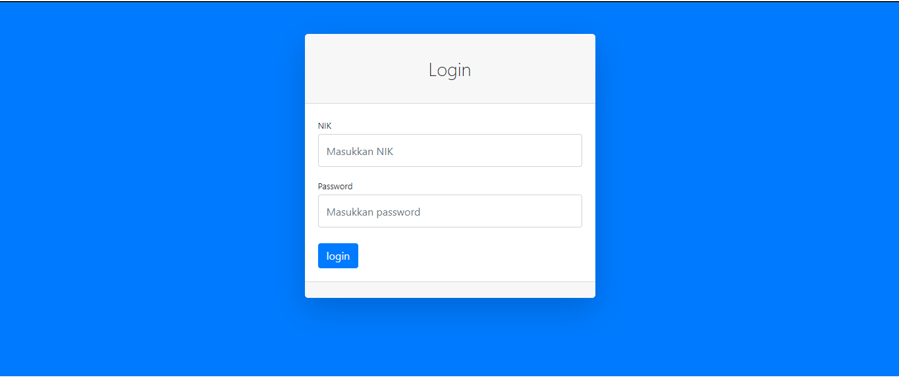
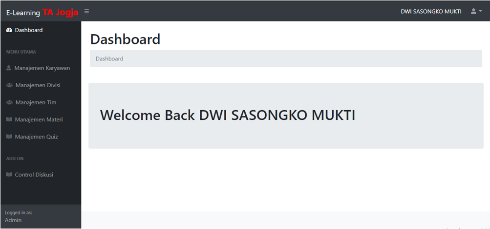
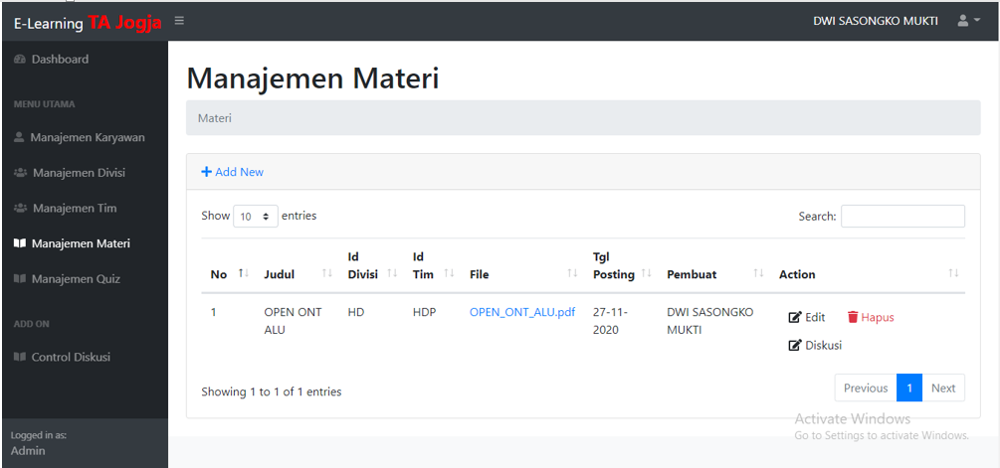
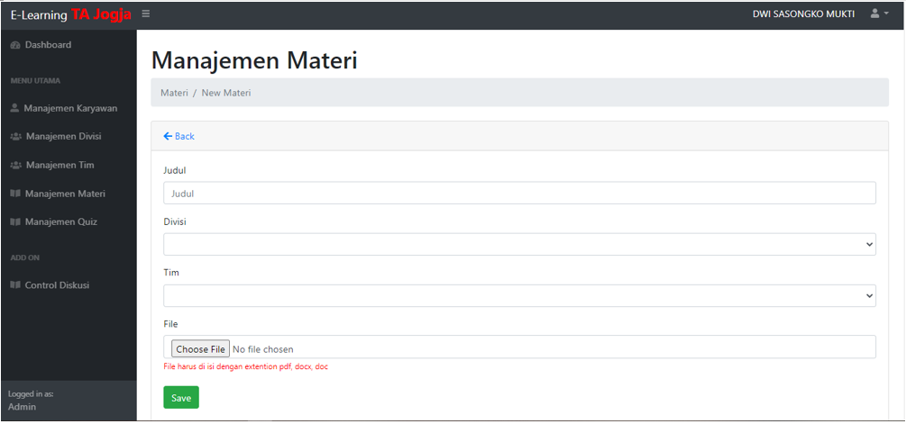

# WEBSITE INI DIBUAT UNTUK KEBUTUHAN SKRIPSI

Website elerning ini memiliki 3 level user yaitu Admin, Pemberi Materi dan Penerima Materi. Level user ditetapkan berdasarkan jabatannya. Website ini dibuat dengan CodeIgniter 3, Bootstrap SB Admin dan Xampp.

## Beberapa Features Yang Ada

1. Login	
	 

2. Dashboard	
	

3. Materi	
	

4. Tambah Materi	
	

5. dll.

## Source
- https://codeigniter.com/download
- https://startbootstrap.com/template/sb-admin
- https://www.apachefriends.org/download.html

### copyright@nocsas 2020-2021